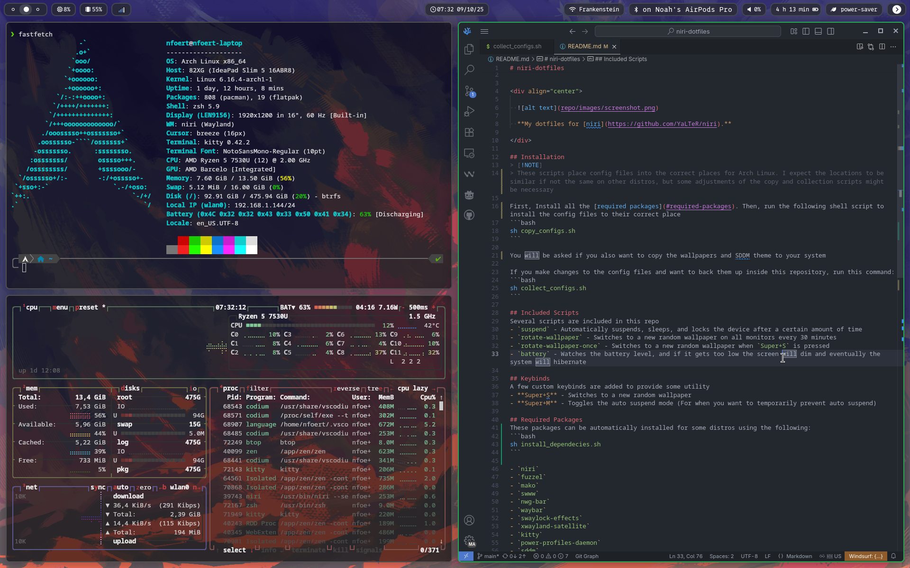

# niri-dotfiles


<div align="center">

  

  **My dotfiles for [niri](https://github.com/YaLTeR/niri).**

</div>

## Installation
First, Install all of the [required packages](#required-packages). Then, run the following shell script to install of the config files to their correct place
```
sh copy_configs.sh
```

If you make changes to the config files and want to back them up inside this repository, run this command:
```
sh collect_configs.sh
```


## Required Packages

- `niri`
- `fuzzel`
- `mako`
- `swww`
- `nwg-bar`
- `waybar`
- `swaylock`
- `xwayland-satellite`

## To-Do
- [ ] Make `xwayland-satellite` start on compositor start
- [ ] Make a customized terminal